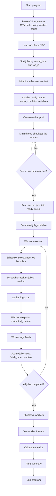
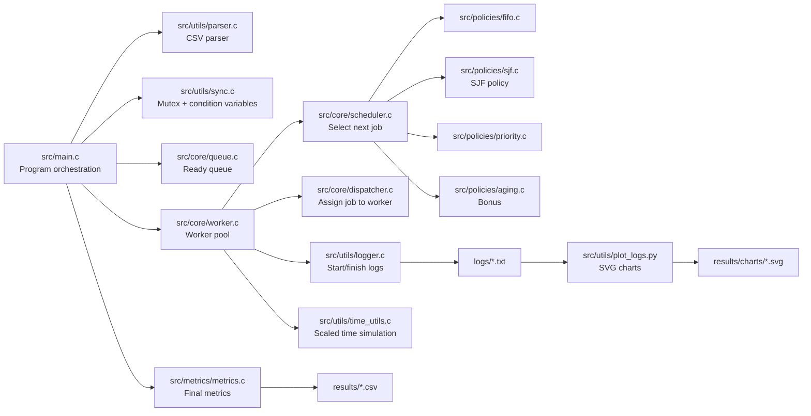
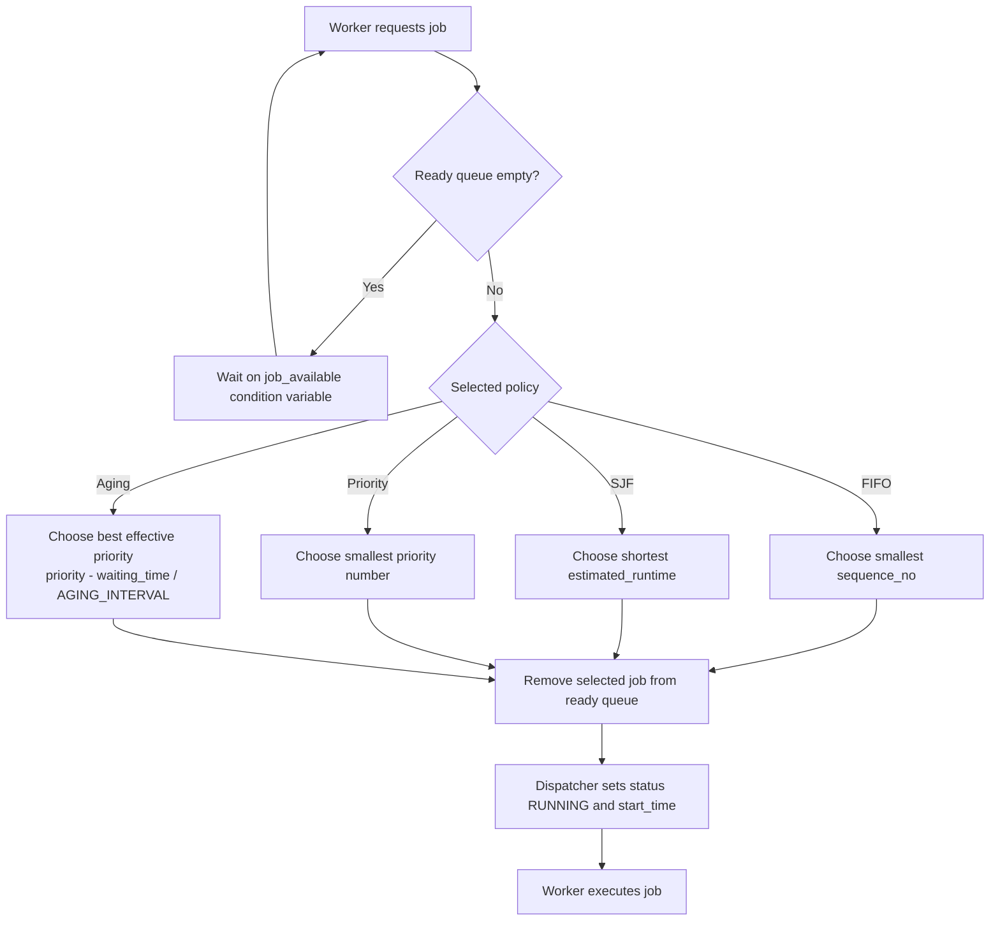
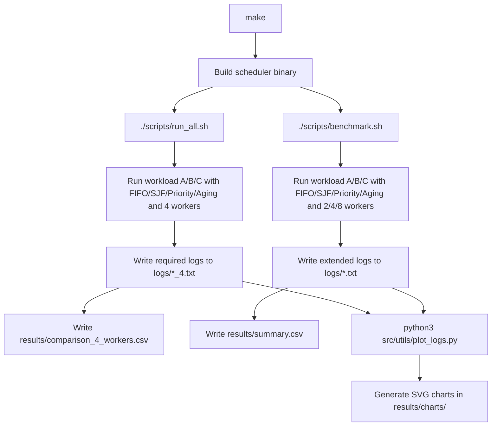
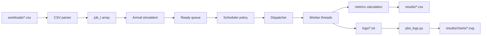

# Project Workflow

This document provides Markdown/Mermaid diagrams for the Mini Background Job Scheduler project.

## 1. Runtime Workflow

## 2. Module Workflow

## 3. Scheduling Decision Workflow

## 4. Experiment Workflow

## 5. Data Flow

